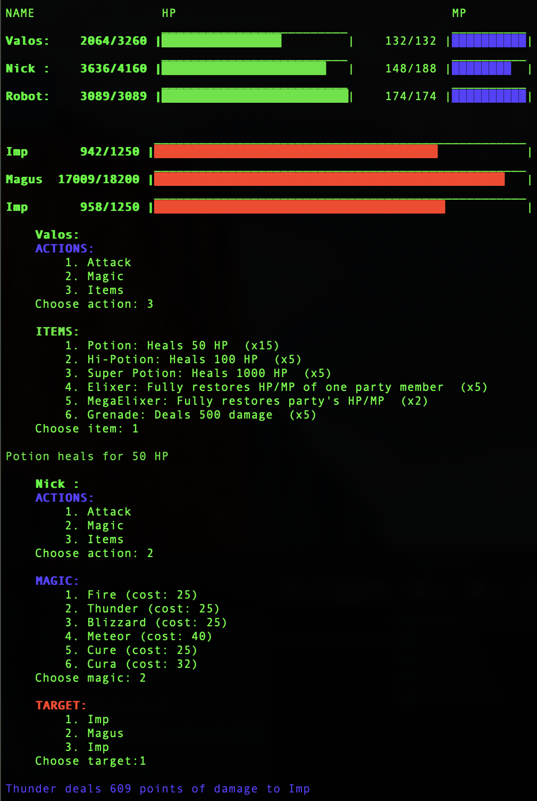

# BattleRPG

Turn-based role-playing game.

## Player moves:
- [x] Regular attack (random damage)
- [x] Magic (costs points)
- [x] Items (limited number of healing potions)

Enemy will seem artificially intelligent and heal when HP goes below threshold.

## Features to be added:
1. GUI using Pygame.
2. Leveling system - Characters will gain experience points from battles and level up. Enemy attributes will scale to character levels.
